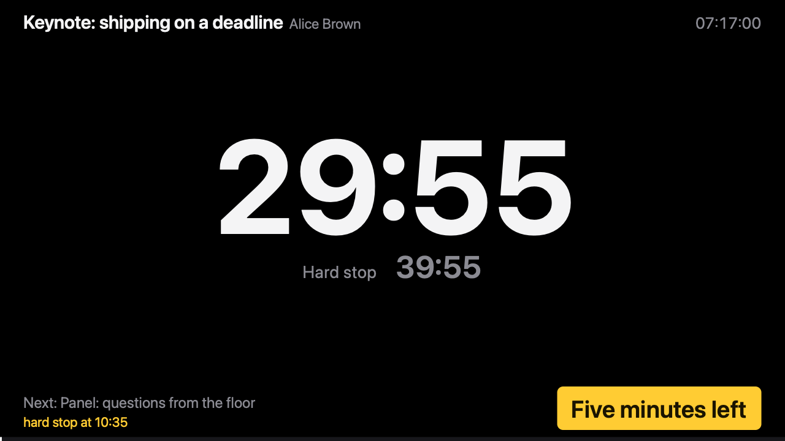
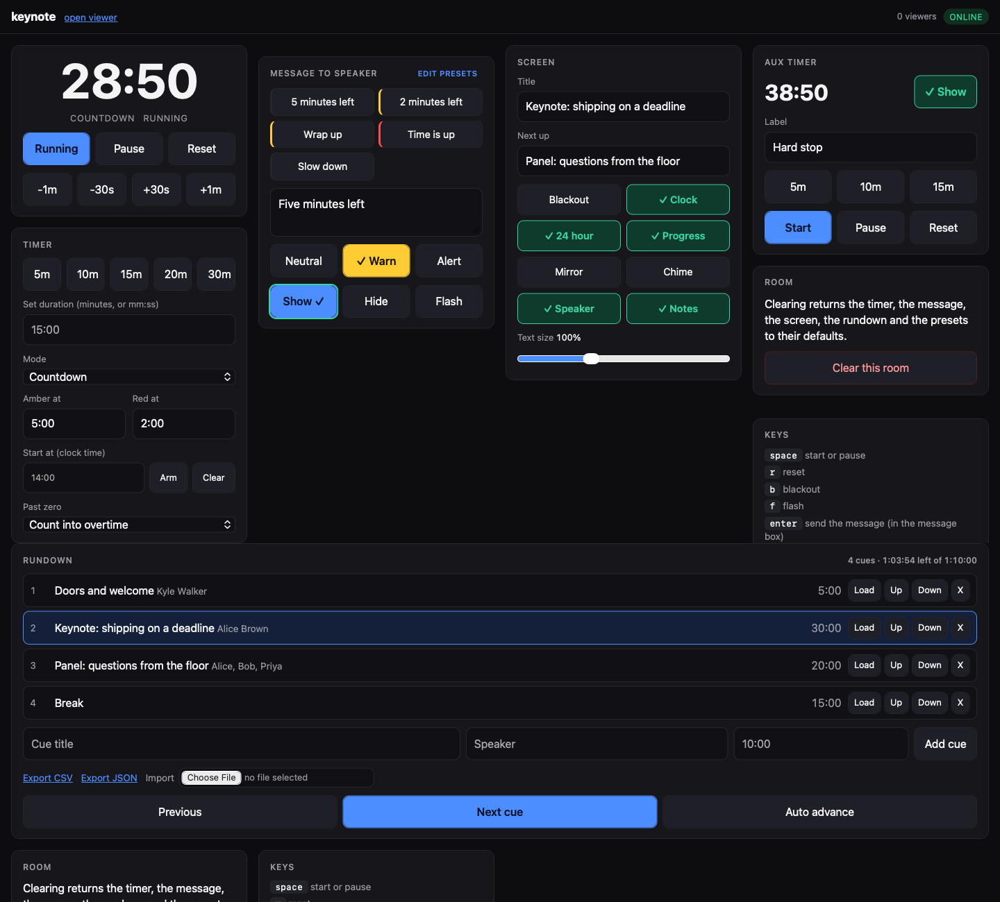
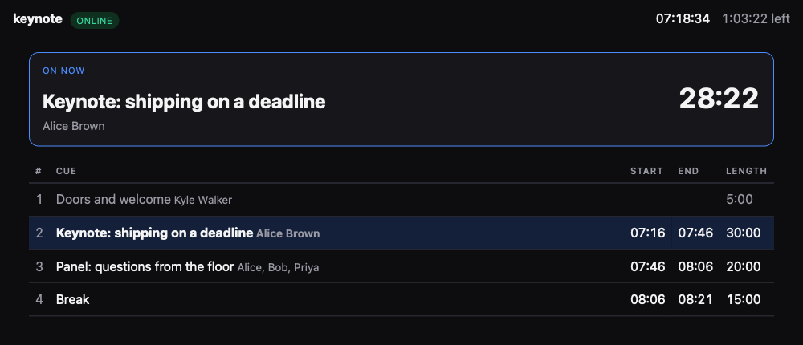

# SimpleConfidenceMonitor

A speaker timer and confidence monitor in one Rust binary. An operator drives the
timer from a phone, tablet or laptop, and the stage display follows in real time
in any browser.

[](https://github.com/KyleJamesWalker/SimpleConfidenceMonitor/actions/workflows/ci.yml)
[](LICENSE)

## Overview

Give a room a name. The stage display opens `/<room>`, the operator opens
`/<room>/edit`, and both stay in step over a WebSocket. The server creates the
room on first request, so setup is one URL.

The server owns the clock and each browser measures its own offset from it, so
the digits stay smooth and a display that loses the network keeps counting. There
is no database, no Node toolchain and no internet dependency, which suits a
laptop on a venue network.



The stage display. One large timer, the running cue and its speaker, the second
timer beneath, and the operator's note in the lower right.

What it carries:

- Countdown, count-up and time-of-day timers, with amber and red warnings and
  overtime
- A rundown with auto-advance, an agenda page, and CSV or JSON import and export
- Messages to the speaker, with one-press presets and three tones
- A second timer for a break or a hard stop
- Blackout, flash, a chime at zero, and mirroring for teleprompter glass
- An HTTP API for Bitfocus Companion, a Stream Deck or a shell script

## Requirements

A binary from [the releases page](https://github.com/KyleJamesWalker/SimpleConfidenceMonitor/releases),
or Rust 1.94 and later to build one.

## Setup

```bash
cargo build --release
./target/release/simple-confidence-monitor --token s3cret
```

Or with Docker:

```bash
docker run --rm -p 8080:8080 -v scm-state:/data \
  ghcr.io/kylejameswalker/simpleconfidencemonitor:latest --token s3cret
```

The image serves on 8080 and keeps rooms in `/data`, so mount a volume there.
Those two come from `SCM_PORT` and `SCM_STATE_DIR` in the image, so an argument
after the image name overrides them rather than colliding.

The log prints the address to open. The picker at `/` builds the links for a room
and shows a QR code for the stage display.

## Usage

| Screen | URL | Needs the token |
|---|---|---|
| Stage display | `http://<host>:8080/keynote` | no |
| Operator console | `http://<host>:8080/keynote/edit` | yes |
| Agenda | `http://<host>:8080/keynote/agenda` | no |



The console drives everything from one page: the transport and thresholds, quick
messages, the screen toggles, the second timer, and the running order.



The agenda is read-only, for backstage and for the speakers. Clock times follow
the running cue, so an overrun moves every later cue with it.

The console keys carry the hot path during a talk. `space` starts and pauses,
`r` resets, `b` blacks out, `f` flashes, and `n` and `p` step the rundown.

Every action is also an HTTP call:

```bash
curl -X POST http://localhost:8080/api/rooms/keynote/cmd \
  -H 'content-type: application/json' -H 'authorization: Bearer s3cret' \
  -d '{"cmd": "set_duration", "ms": 900000}'
```

## Configuration

| Flag | Default | Controls |
|---|---|---|
| `--port` | `8080` | Listening port |
| `--bind` | `0.0.0.0` | Listening address |
| `--token` | none | Required to open the console and to send commands |
| `--state-dir` | none | Keeps rooms across a restart |
| `--mdns` | off | Advertises the server on the local network |

[docs/operations.md](docs/operations.md) covers each one, the full API, the
per-screen overrides and what to do when something goes wrong.

## Development

```bash
make test     # cargo test, then the JavaScript tests
make lint     # clippy with warnings denied, and a format check
```

[docs/development.md](docs/development.md) covers the layout and the two rules
that keep the frontend honest.

## Documentation

- [Running a session](docs/operations.md)
- [Architecture](docs/architecture.md)
- [Developing](docs/development.md)
- [Cutting a release](docs/release.md)

## License

MIT. See [LICENSE](LICENSE).
